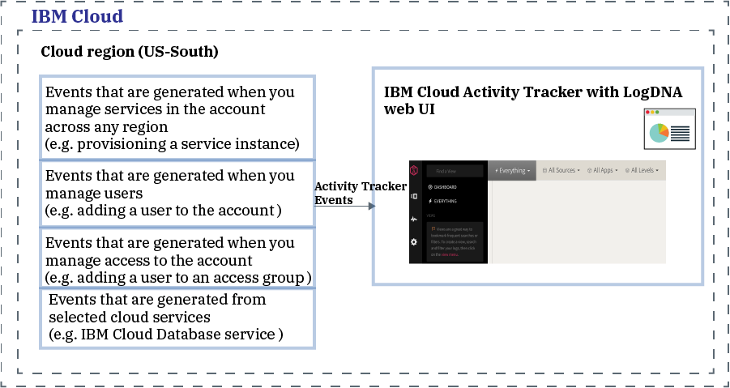
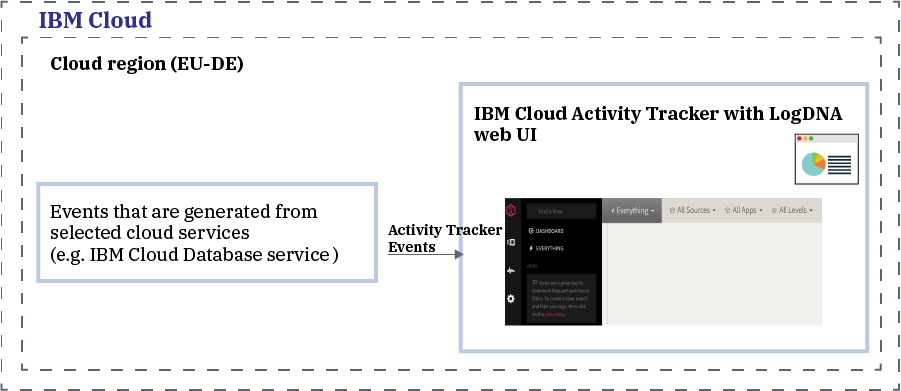

---

copyright:
  years: 2019
lastupdated: "2019-03-25"

keywords: IBM Cloud, LogDNA, Activity Tracker, getting started

subcollection: logdnaat

---

{:new_window: target="_blank"}
{:shortdesc: .shortdesc}
{:screen: .screen}
{:pre: .pre}
{:table: .aria-labeledby="caption"}
{:codeblock: .codeblock}
{:tip: .tip}
{:download: .download}
{:important: .important}
{:note: .note}

# Getting started tutorial
{: #getting-started}

Use the {{site.data.keyword.at_full}} service to track how applications interact with the {{site.data.keyword.cloud_notm}} services. Use {{site.data.keyword.at_full_notm}} to monitor for abnormal activity, and comply with regulatory audit requirements. The events that are collected comply with the Cloud Auditing Data Federation (CADF) standard.
{:shortdesc}

{{site.data.keyword.at_full_notm}} collects and stores audit records for API calls made to resources that run in the {{site.data.keyword.cloud_notm}}. You can archive these events on {{site.data.keyword.cloud_notm}} for long-term storage.
{: note}

## About {{site.data.keyword.at_full}}
{: #ov}

Compliance with internal policies and industry regulations is a key requirement in any organization's strategy, regardless of where applications run: on-premises, in a hybrid cloud, or in a public cloud. The {{site.data.keyword.at_full_notm}} service provides the framework and functionality to monitor API calls to services on the {{site.data.keyword.cloud_notm}} and produces the evidence to comply with corporate policies and market industry-specific regulations.

When you work in a cloud environment, such as the {{site.data.keyword.cloud_notm}}, you must plan the cloud strategy for auditing and monitoring workloads and data in accordance with your internal policies and with industry and country-based compliance requirements. You can use the information that is registered through the {{site.data.keyword.at_full_notm}} service to identify security incidents, detect unauthorized access, and comply with regulatory and internal auditing requirements.

* {{site.data.keyword.at_full_notm}} offers high-level security governance for your IT resources in the cloud.
* {{site.data.keyword.at_full_notm}} provides a solution for administrators to capture, store, view, search, and monitor API activity in a single place. It also offers a notifications feature to alert you by using any of the supported notification channels.
* {{site.data.keyword.at_full_notm}} provides capabilities to export events that you can then use to generate an audit trail report. You might require these reports so that your organization complies with internal regulations and external industry and country regulations.

For example, you can use the {{site.data.keyword.at_full_notm}} activity logs to identify the following information:
* The users who made API calls to cloud services
* The time-stamp when the API calls were made
* The status of the API call
* The criticallity of the action

Consider the following information about security when you work with the {{site.data.keyword.at_full_notm}} service:

* IBM services that generate {{site.data.keyword.at_full_notm}} events follow the {{site.data.keyword.IBM_notm}} Cloud security policy. For more information, see [Trust the security and privacy of IBM Cloud ](https://www.ibm.com/cloud-computing/learn-more/why-ibm-cloud/security/){: new_window}.
* The {{site.data.keyword.at_full_notm}} service captures user-initiated actions that change the state of Cloud services. The information does not provide direct access to databases or applications.
* Only authorized users can view and monitor {{site.data.keyword.at_full_notm}} event logs. Each user is identified by their unique ID in the {{site.data.keyword.cloud_notm}}.

## Objectives
{: #gs_objectives}

Complete this tutorial to learn how to provision and manage access to the service in the {{site.data.keyword.cloud_notm}}. Find out what common data is available in each event and how it can help you monitor your cloud environment. Learn to navigate in the web UI. 

## Prerequisites
{: #gs_prereq}

* You need a user ID that is a member or an owner of an {{site.data.keyword.cloud_notm}} account. To get an {{site.data.keyword.cloud_notm}} user ID, go to: [Registration ](https://cloud.ibm.com/login){:new_window}.

* Your {{site.data.keyword.IBM_notm}}ID must have assigned IAM policies to work in the {{site.data.keyword.cloud_notm}}. The following table lists the minimum permissions that you need to complete this tutorial: 

| Resource                             | Scope of the access policy | Role    | Region    | Information                  |
|--------------------------------------|----------------------------|---------|-----------|------------------------------|
| Resource group **Default**           |  Resource group            | Viewer  | us-south  | This policy is required to allow the user to see service instances in the Default resource group.    |
| {{site.data.keyword.at_full_notm}} service |  Resource group            | Editor  | us-south  | This policy is required to allow the user to provision and administer the {{site.data.keyword.at_full_notm}} service in the Default resource group.   |
| ADD BASED ON SERVICE |   |
{: caption="Table 1. List of IAM policies required to complete the tutorial" caption-side="top"} 

* If you prefer to work with the command line, you must install the {{site.data.keyword.cloud_notm}} CLI. For more information, see [Installing the {{site.data.keyword.cloud_notm}} CLI](/docs/cli?topic=cloud-cli-ibmcloud-cli#ibmcloud-cli).

## Step 1. Provision an instance of the {{site.data.keyword.at_full_notm}} service
{: #gs_step1}

Complete the following steps to provision an instance:

1. [Log in to your {{site.data.keyword.cloud_notm}} account ](https://cloud.ibm.com/login){:new_window}.

	After you log in with your user ID and password, the {{site.data.keyword.cloud_notm}} dashboard opens.

2. In the navigation menu, select **Observability**. 

3. Select **Activity Tracker**. 

    The list of instances that are available on {{site.data.keyword.cloud_notm}} is displayed.

4. Select one instance. Then, click **View LogDNA**.

The web UI opens.

## Step 2. Manage access to the service
{: #gs_step2}

**Every user that accesses the {{site.data.keyword.at_full_notm}} service in your account must be assigned an access policy with an IAM user role defined.** The policy determines what actions the user can perform within the context of the service or instance you select. The allowable actions are customized and defined as operations that are allowed to be performed on the service. The actions are then mapped to IAM user roles. 

In this tutorial, you will learn how to grant a user management permissions to work with the {{site.data.keyword.at_full_notm}} service within the context of a resource group. [Learn more](/docs/services/Activity-Tracker-with-LogDNA?topic=logdnaat-iam#iam).

### 1. Create an access group
{: #gs_step2_step1}

Complete the following steps to create an access group:

1. From the menu bar, click **Manage** &gt; **Access (IAM)**, and select **Access Groups**.
2. Click **Create**.
3. Enter a name and optional description for your group, and click **Create**.

### 2. Add permissions to manage events
{: #gs_step2_step2}

After you set up your group, you can assign a common access policy to the group.

To grant a user administrator role to manage instances within a resource group in the account, the user must have an IAM policy for the {{site.data.keyword.at_full_notm}} service with the platform role **Administrator** within the context of the resource group. 

Complete the following steps to assign a policy to an access group through the UI:

1. From the menu bar, click **Manage** &gt; **Access (IAM)**.
2. Select **Access Groups**.
3. Select the name of the group that you want to assign access to. 
4. Click **Access policies**.
5. Click **Assign access**.
6. Select **Assign access within a resource group**.
7. Select a resource group.
8. If the user does not have a role that is already granted for the selected resource group, choose a role for the **Assign access to a resource group** field. 

    Depending on the role that you select, the user can view the resource group on their dashboard, edit the resource group name, or manage user access to the group. 
    
    You can select **No access**, if you want the user to have access only to the {{site.data.keyword.at_full_notm}} service in the resource group.

9. Select **IBM Cloud Activity Tracker with LogDNA**.
10. Select the platform role **Administrator**.
11. Select the service role **Manager**.
12. Click **Assign**.

### 3.  Add the user to the group
{: #gs_step2_step3}

Complete the following steps to add the user to the access group:
1. Click **Add users** on the **Users** tab.
2. Select the user that you want to add from the list, and click **Add to group**.

## Step 3. Learn about the structure of an event
{: #gs_step3}

Events comply with the **Cloud Auditing Data Federation (CADF) standard**. The CADF standard defines a full event model that includes the information that is needed to certify, manage, and audit security of applications in cloud environments.

The CADF event model includes the following components:

| Component | Description |
|------------|----------------------------|
| `Action`   | The action is the operation or activity that an initiator performs, attempts to perform, or is waiting to complete. |
| `Initiator`| The initiator is the resource that makes an API call and generates a CADF event. The event that is triggered depends on the action that is requested by the API call. |
| `Observer` | The observer is the resource that creates and stores a CADF record from information available in a CADF event. |
| `Outcome`  | The outcome is the status of the action against the target. |
| `Target`   | The target is the resource against which the action is performed, attempted to perform, or is pending to complete. |
{: caption="Table 2. Components that are available in a CADF event model" caption-side="top"} 

## Step 4. Generate {{site.data.keyword.at_full_notm}} events
{: #gs_step4}

## Step 5. Launch the web UI 
{: #gs_step5}

Complete the following steps to launch the web UI:

1. Log in to your {{site.data.keyword.cloud_notm}} account.

    Click [{{site.data.keyword.cloud_notm}} dashboard ](https://cloud.ibm.com/login){:new_window} to launch the {{site.data.keyword.cloud_notm}} dashboard.

	After you log in with your user ID and password, the {{site.data.keyword.cloud_notm}} dashboard opens.

2. In the navigation menu, select **Observability**. 

3. Select **Activity Tracker**. 

    The list of instances that are available on {{site.data.keyword.cloud_notm}} is displayed.

4. Select one instance. Then, click **View LogDNA**.

The Web UI opens.

## Step 6. Viewing events
{: #gs_step6}

The {{site.data.keyword.at_full_notm}} service captures activity data that is related to API calls and other actions that are made to selected cloud services in the {{site.data.keyword.cloud_notm}}. 

* Events are collected automatically. 
* Events that are collected in {{site.data.keyword.at_full_notm}} comply with the **Cloud Auditing Data Federation (CADF) standard**. The CADF standard defines a full event model that includes the information that is needed to certify, manage, and audit security of applications in cloud environments.
* {{site.data.keyword.at_full_notm}} stores and groups events by region. 
* Events that report on global {{site.data.keyword.cloud_notm}} account actions, are collected and stored in the **US-South** region.
* The service plan that you select for your {{site.data.keyword.at_full_notm}} instance determines the number of days that events are available for search through the web UI. 

For example, the following diagram shows what type of events you can manage through the `US South` web UI:

The following diagram shows what type of events you can manage through the `EU-DE` web UI:

At any time, you can view each event line in context. Complete the following steps to view an event in context: 

1. In the web UI, click the **Views** icon .
2. Select **Everything**.
3. Identify a line that you want to explore.
4. Expand the event line. 

    Information about line identifiers, tags, and labels is displayed.

5. Click **View in Context** to see the event line in context of other entries from that host, app, or both.

When you finish exploring the event, click **Close** to close the line.

[Learn more](/docs/services/Activity-Tracker-with-LogDNA?topic=logdnaat-view_events.md#view_events.md).

## Next steps
{: #gs_next_steps}

Upgrade the {{site.data.keyword.at_full_notm}} service plan to a paid plan to be able to [filter events](/docs/services/Activity-Tracker-with-LogDNA?topic=logdnaat-views.md#views_step1), [search events](/docs/services/Activity-Tracker-with-LogDNA?topic=logdnaat-views.md#views_step2), [define views](/docs/services/Activity-Tracker-with-LogDNA?topic=logdnaat-views.md#views_step3), and [configure alerts](/docs/services/Activity-Tracker-with-LogDNA?topic=logdnaat-alerts.md#alerts.md). 

For more information about {{site.data.keyword.at_full_notm}} service plans, see [Service plans](/docs/services/Activity-Tracker-with-LogDNA?topic=logdnaat-service_plan#service_plan).

