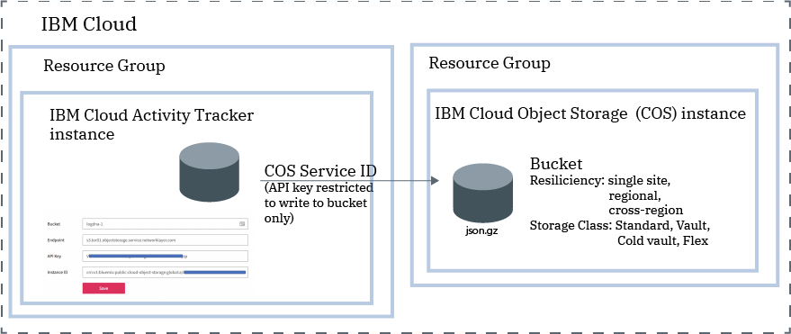

---

copyright:
  years: 2019, 2021
lastupdated: "2021-01-05"
subcollection: Activity-Tracker-with-LogDNA

---

{:new_window: target="_blank"}
{:shortdesc: .shortdesc}
{:screen: .screen}
{:pre: .pre}
{:table: .aria-labeledby="caption"}
{:codeblock: .codeblock}
{:tip: .tip}
{:download: .download}
{:important: .important}
{:note: .note}
{:beta: .beta}


# Managing events in your account
{: #manage_events}

{{site.data.keyword.at_full_notm}} is used to collect, archive, view and analyze events. 
{:shortdesc}


## Collecting events to monitor activity in the account
{: #manage_events_provision}

In {{site.data.keyword.at_full_notm}}, events are collected automatically for most enabled-AT services. However, some services might require an upgrade of the service plan, a configuration setting, or both, for you to be able to collect and analyze them. [Learn more](/docs/Activity-Tracker-with-LogDNA?topic=Activity-Tracker-with-LogDNA-events_collect).


## Defining views, dashboards, and screens to analyze events
{: #manage_events_category}

You can define [views](/docs/Activity-Tracker-with-LogDNA?topic=Activity-Tracker-with-LogDNA-views), dashboards, and screens to analyze events and monitor activity in your account. 

Categories are used to group resources of the same type so that users can easily find them.  You can use categories to group views, dashboards, and screens.

Categories are defined in the **Categories** section in the web UI. 

The service plan determines the number of days that you have data available for search through the UI.
{: important}


## Archiving events for long-term storage
{: #manage_events_archive}

You can archive events from an {{site.data.keyword.at_full_notm}} instance into a bucket in an {{site.data.keyword.cos_full_notm}} (COS) instance. [Learn more](/docs/Activity-Tracker-with-LogDNA?topic=Activity-Tracker-with-LogDNA-archiving).

* Events are automatically archived in a compressed format **(.json.gz)**. Each event preserves its metadata.
* Events are archived within 24-48 hours after you save the configuration. 
* Logs are archived hourly. 

    Previously, logs have been archived daily. Through this transition, you might observe a small overlap between the older daily format archives and the new archives.
    {: note}

* The hourly archive directory format looks like this:

    ```
    YYYY/MM/DD/<accountID>.<YYYY>-<MM>-<DD>.<HH>00.json.gz
    ```
    {: codeblock}
    
    Where 

    `YYYY` represents the year; `MM` represents the month; and `DD` represents the day.

    `<accountID>` represents the LogDNA account ID, that is, the ID that showd in the [UI URL](/docs/Activity-Tracker-with-LogDNA?topic=Activity-Tracker-with-LogDNA-get_logdna_web_url).
    
    `HH` represents hours in 24 format. 

    The daily archive directory format looks like this:
    
    ```
    <accountID>.<YYYY>-<MM>-<DD>.<clusterId>.json.gz
    ```
    {: codeblock}
     
* The timestamp that is used to determine whether the event is included in an archive is the UTC timestamp.

    Depending on your location, there might be events that you see in local time in your views on a specific day. However, you cannot find them in the archive file. You are most likely viewing events in local time and the archive process uses the UTC timestamp.

* After you configure archiving, the first archive file is created when the archiving process runs and there is data.
* The first time the archive process runs the number of days archived is dependent on the plan:

    * The maximum number of days that data is archived includes events for the past 30 days when the instance has a `30 day search` plan.

    * The maximum number of days that data is archived includes events for the past 14 days when the instance has a `14 day search` plan.

    * The maximum number of days that data is archived includes events for the past 7 days when the instance has a `7 day search` plan.

For example, you have a service plan of 30 days. You configured the instance 10 days ago. You enable archiving on the 10th day. The archiving process generates multiple files. Each file includes events for the period of time indicated as part of its name. If there is no data, the archive file for that period is empty.

Each {{site.data.keyword.at_full_notm}} instance has its own archiving configuration.
{: important}

The following figure shows a high-level view of the different components that are integrated when archiving events:



The {{site.data.keyword.cos_full_notm}} instance is provisioned within the context of a resource group. The {{site.data.keyword.at_full_notm}} instance is also provisioned within the context of a resource group. Both instances can be grouped under the same resource group or in different ones. 

{{site.data.keyword.at_full_notm}} uses a service ID to communicate with the {{site.data.keyword.cos_full_notm}} service.
* The service ID that you create for an {{site.data.keyword.cos_full_notm}} instance is used by {{site.data.keyword.at_full_notm}} to authenticate and access the {{site.data.keyword.cos_full_notm}} instance. 
* You can assign specific access policies to the service ID that restrict permissions on the {{site.data.keyword.cos_full_notm}} instance. Restrict the service ID to only have writing permissions on the bucket where you plan to archive the events.
* You can also restrict the IP addresses that are allowed to manage the bucket.

**Archiving in an EU-managed location:** You must configure a bucket that complies with the EU-managed and GDPR regulations.
{: important}


## Viewing archived events by using the SQL Query service
{: #manage_events_sqlquery}


{{site.data.keyword.sqlquery_short}} provides a serverless, no-ETL solution to easily query data stored in COS. [Learn more](/docs/sql-query?topic=sql-query-overview).

You can use this service to analyze data from archived files in COS. 

Once you have SQL Query running on IBM Cloud, you can immediately start querying your data using the SQL Query user interface, programmatically by using either the REST API or the Python `ibmcloudsql` library, or write a serverless function by using {{site.data.keyword.openwhisk_short}}.

When you query events:
* You must provision an instance of the {{site.data.keyword.sqlquery_short}} service.
* You must restrict user access to work with that instance. Users need the platform **viewer** role to launch the UI, and the service **writer** role to run queries.
* When you open the UI, the {{site.data.keyword.sqlquery_short}} service automatically generates a unique COS bucket that will store all of the results as CSV files from your SQL queries. To make sure that you are using a custom bucket, create one. You can specify your custom bucket as the place to to store results. 


