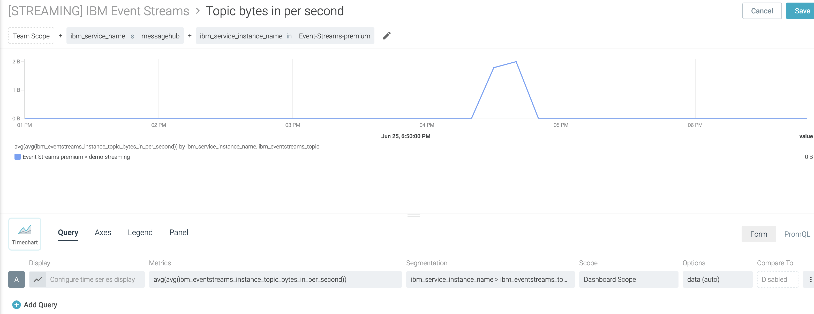

---

copyright:
  years: 2019, 2021
lastupdated: "2021-07-01"

keywords: IBM Cloud, Activity Tracker, streaming

subcollection: activity-tracker

---

{:new_window: target="_blank"}
{:shortdesc: .shortdesc}
{:screen: .screen}
{:pre: .pre}
{:table: .aria-labeledby="caption"}
{:codeblock: .codeblock}
{:tip: .tip}
{:download: .download}
{:important: .important}
{:note: .note}
{:external: target="_blank" .external}
{:deprecated: .deprecated}

# Monitoring streaming
{: #streaming-monitor}

You can use {{site.data.keyword.mon_full_notm}} and {{site.data.keyword.at_full_notm}} to monitor streaming of data from your {{site.data.keyword.at_short}} instance.
{:shortdesc}


## Monitoring streaming by using {{site.data.keyword.mon_full_notm}}
{: #streaming-monitor-1}

{{site.data.keyword.messagehub}} is integrated with the {{site.data.keyword.mon_short}} service. {{site.data.keyword.mon_short}} provides a default template that you can customize to monitor the {{site.data.keyword.messagehub}} instance, how data is streamed out of {{site.data.keyword.at_short}} and consumed by any application or service that is subscribed to {{site.data.keyword.messagehub}}.


Complete the following steps to monitor the {{site.data.keyword.messagehub}} instance:

1. Check that you have an instance of the {{site.data.keyword.mon_short}} in the same region as your {{site.data.keyword.messagehub}} instance. This instance must be configured to collect platform metrics. For more information, see [Enabling platform metrics](/docs/monitoring?topic=monitoring-platform_metrics_enabling).
2. [Launch the {{site.data.keyword.mon_short}} UI](/docs/monitoring?topic=monitoring-launch).
3. In the **Dashboards** section, go to **Dashboard templates** and select the template **IBM Event Streams (Enterprise)**.
4. Create a copy of the temnplate by clicking **Create custom dashboard**.

    You can use the metric *Topic bytes in per second* to see how data is sent by {{site.data.keyword.at_short}} to {{site.data.keyword.messagehub}}.

    You can use the metric *Topic bytes out per second* to see how data is consumed by any application or service that is subscribed to {{site.data.keyword.messagehub}}.

5. (Optional) Edit the panel *Topic bytes in per second*. 

     

    Then, customize the metric to see data per topic.

     

    Check that the resolution is set to **10M**.


## Monitoring streaming by using {{site.data.keyword.at_full_notm}}
{: #streaming-monitor-2}

Streaming generates {{site.data.keyword.at_short}} events with the action **logdnaat.streaming-logs.send** to notify about failures by sending data to {{site.data.keyword.messagehub}}. 

There are different reasons for failure, for example:

- **unknown_topic or unknown_topic_or_partition**: This notification reports that the topic that is configured for streaming is not valid.  

    If you get this notification, check the topic that is configured for streaming is defined in {{site.data.keyword.messagehub}}.

- **broker_handle_destroyed**: This notification reports a change in the Kafka cluster configuration. 

    If you get this notification, check the SASL URLs and update the streaming configuration. 

- **authentication_failure**: This notification reports a failure to authenticate with {{site.data.keyword.messagehub}}.

    If you get this notification, check the credentials that are configured for streaming.

- **broker_transport_failure**: This notification reports connectivity problems with {{site.data.keyword.messagehub}}. There are different reasons why you might get this notification such as that credentials were deleted after streaming was activated and started.

- **message_timed_out or timed_out**: This notification reports generic timeout errors when streaming messages to {{site.data.keyword.messagehub}}. 


The {{site.data.keyword.at_short}} event includes different fields that you can use to monitor streaming data failures:
- `reason.reasonCode = 500` and `severity = critical` notify of a failure streaming data.
- `reason.reasonType` indicates the type of failure.
- `target.typeURI = logdna/account/streaming-notification` indicates that the event is a notification event.

The following sections include samples of some fields in the notification event that you can use to monitor and be alerted when a failure happens:

```json
"requestData": {
        "notificationType": "unknown_topic_or_partition",
        "start": "2021-06-29T21:33:52.333Z",
        "end": "2021-06-29T21:35:13.772Z",
        "topic": "kafka-java-console-sample-topic",
        "error": "Error: Broker: Unknown topic or partition"
    },
```
{: codeblock}

```json
"reason": {
        "reasonCode": 500,
        "reasonType": "unknown_topic_or_partition",
        "reasonForFailure": "Error: Broker: Unknown topic or partition"
    },
```
{: codeblock}

```json
"target": {
        "id": "crn:v1:staging:public:logdna:us-south:a/9bb3ea01633c4d828080de16ce34ea70:d8ba830f-b0e0-4c42-9345-8981d4a94b31:streaming-logs:",
        "typeURI": "logdna/account/streaming-notification"
```
{: codeblock}


### Query to monitor failures
{: #streaming-monitor-2-1}

In {{site.data.keyword.at_short}}, you can create a view with the following query to filter for event stream failure notifications:

```
action:logdnaat.streaming-logs.send reason.reasonCode:500 severity:critical target.typeURI:"logdna/account/streaming-notification"
```
{: codeblock}

You can define a presence alert on this view to notify you as soon as 1 event reporting failure comes in.

In addition, you can create views for each type of notification. For example, to monitor for a failure to authenticate with {{site.data.keyword.messagehub}}, you can use the following query:

```
action:logdnaat.streaming-logs.send reason.reasonCode:500 severity:critical target.typeURI:"logdna/account/streaming-notification" requestData.notificationType:"authentication_failure"
```
{: codeblock}
